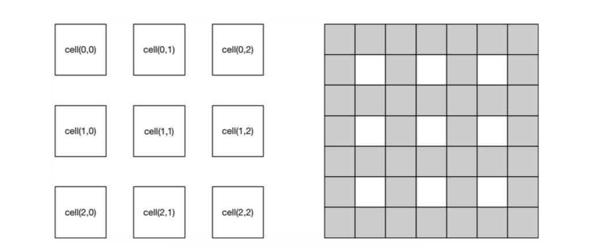
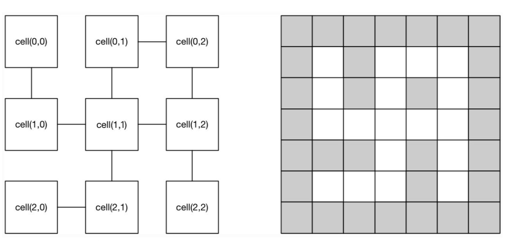

[TOC]

# 项目介绍

本程序使用计算机生成一个迷宫，使用道路网格表示迷宫的道路，例如，可以使用3*3 的道路网格生成一个7* 7的渲染网格，如图1所示

                     
                     图1 ​3 x 3 的 ​道路网格 ​及其 ​渲染网格
如果迷宫的道路网格两个相邻的cell连通，则可以打通道路，如图2所示

                    
                    图2  ​3 x 3 连通迷宫的道路网格​和​渲染网格
连通道路网格有以下约束条件：
    - 每个cell只能直接与相邻正南、正北、正东、正西的cell连通。不能够和其它的cell连通
    - 两个cell之间的连通是双向的，即cell(0,0)和cell(1,0)连通相当于cell(1,0)和cell(0,0)连通
# 程序介绍
本程序能够允许用于输入道路网格尺寸和道路网格的连通性定义，分两行输入。
其中第一行是道路网格的尺寸；
第二行是道路网格的连通性定义；

## 有效性检查
本程序自动检查用户输入的有效性，有效性检查包括：
- 无效的数字
- 数字超出预定范围
- 格式错误
- 连通性错误

## 程序特点
- 可扩展性高，可灵活配置渲染网格方式
- 可维护，程序分为模块模块，如需修改，仅需修改部分内容即可
- 可复用，程序封装了大量的方法，包括以下方法
    -  检查数据有效性方法
    -  初始化参数方法
    -  检查迷宫连通性方法
    -  渲染网格映射规则
    -  连通迷宫方法
    -  打印迷宫渲染网格方法
    
## 测试用例
本程序提供大量测试数据，覆盖各种可能会遇到的情况，具体包括以下类型：

* 错误测试用例包括
    *  迷宫尺寸：
        - 迷宫尺寸包含无效数字
        - 迷宫尺寸参数不足，格式错误
        - 迷宫尺寸数字范围超出预定范围
    *  连通性定义：
        - 包含无效数字
        - 数字超出范围,包括数字为负数以及数字超过迷宫尺寸
        - 格式错误，包括坐标点缺失，每组连通点数量不为2，包含不合法字符
        - 连通性错误，与不相邻坐标相连
* 正确测试用例包括：
    - 3*3 迷宫道路网格
    - 5*4 迷宫道路网格

## 运行方法
- 运行环境
    - python3 
- 执行命令
由于本程序将测试用例写在txt文档中，所以只需要运行主程序即可,在文件主目录运行
`python maze.py`

